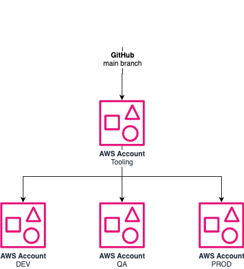

# aws-cdk-cicd-kit

Cross-account CI/CD pipeline built with AWS CDK Pipelines. Deployed in a **tooling account**, it delivers changes sequentially to **dev → qas → prd** accounts via CodePipeline.

## Architecture



## Project structure

```
bin/                    Entry point — instantiates PipelineStack
config/
├── types.ts            Interfaces: AccountConfig, EnvironmentConfig, PipelineConfig, ProjectConfig
├── config.ts           pipelineConfig — the single source of truth
└── environments/
    ├── dev.ts
    ├── qas.ts
    └── prd.ts
lib/
├── core/
│   ├── pipeline-stack.ts   CodePipeline stack (tooling account)
│   └── app-stage.ts        CDK Stage instantiated per environment
├── services/               Application stacks — one file per service
├── constructs/
│   └── base-stack.ts       Base class for all service stacks
└── CLAUDE.md               lib/ structure guide
docs/
├── architecture.drawio.png Architecture diagram
├── architecture.drawio     Architecture source (draw.io)
└── runbooks/
    └── cross-account-bootstrap.md
```

## Configuration

Fill in the placeholders in `config/config.ts` and `config/environments/`:

| Field | Location |
|-------|----------|
| `project.prefix` | `config/config.ts` |
| `project.usage` | `config/config.ts` |
| Tooling account ID | `config/config.ts` |
| GitHub owner / repo | `config/config.ts` |
| CodeStar connection ARN | `config/config.ts` |
| Dev account ID | `config/environments/dev.ts` |
| QAS account ID | `config/environments/qas.ts` |
| PRD account ID | `config/environments/prd.ts` |

## Adding a service stack

1. Create `lib/services/my-stack.ts` extending `BaseStack`
2. Register it in `lib/core/app-stage.ts`

## Commands

| Command | Description |
|---------|-------------|
| `npm run build` | Type-check (no emit) |
| `npm test` | Run Jest tests |
| `npx cdk synth` | Synthesize CloudFormation template |
| `npx cdk deploy` | Deploy PipelineStack to tooling account |
| `npx cdk diff` | Diff against deployed stack |

## First-time setup

See [`docs/runbooks/cross-account-bootstrap.md`](docs/runbooks/cross-account-bootstrap.md) for bootstrapping all accounts and creating the GitHub CodeStar connection.
